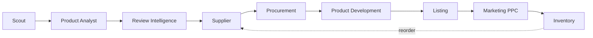

# ABE: mapa de diseño funcional

> Resumen visual y funcional del sistema. El estado de avance vive en el roadmap de [PROJECT.md](../PROJECT.md); el detalle técnico exacto (requisitos, criterios de aceptación, tareas) en `specs/`. Si algo aquí no coincide con `specs/`, **`specs/` es la fuente de verdad**.

## 1. Misión

"Encuentra oportunidades rentables y haz crecer mi negocio Amazon."

Un sistema de agentes de IA que trabaja de forma continua hasta llegar a las decisiones que requieren autorización humana: un sistema cerrado de decisión, no un visor de información.

## 2. Componentes

| Agente | Función | Autonomía |
|---|---|---|
| Scout | Dado un ASIN o keyword, consulta el catálogo y marca candidatos para evaluación; no calcula margen ni estima ventas | 🟢 Autónomo |
| Product Analyst | Evalúa 12 variables y emite `test` / `reject` / `necesita_mas_datos` | 🟢 Autónomo (recomienda, no compromete capital) |
| Review Intelligence | Lee reviews: pain points, deseos, motivos de devolución y PRD de producto v2 | 🟢 Autónomo |
| Supplier | Busca y compara proveedores, calcula landed cost | 🟡 Auto + aprobación (selección final) |
| Procurement | Prepara RFQ y plantilla de orden de compra; nunca envía nada al proveedor | 🟡 Auto + aprobación (la PO solo a petición); el pago es 🔴 solo humano |
| Product Development (futuro, sin fase asignada) | Genera PRD, specs, packaging y copy a partir de pain points | 🟢 Autónomo |
| Listing | Genera título, bullets, descripción y A+; compara contra top 10 | 🟢 Autónomo |
| Marketing (PPC) | Ajusta bids y presupuesto bajo límites; detecta ACOS alto | 🟡 Auto + aprobación (cambios grandes) |
| Inventory | Calcula reorder point y PO recomendada | 🔴 Aprobación humana (compromete capital) |

### De motores a agentes

La visión original definía cinco motores; la arquitectura implementada los reparte en agentes.

| Motor (visión original) | Agente | Qué hace |
|---|---|---|
| Product Intelligence | Scout | Extrae del catálogo (SP-API Catalog Items) ASIN, título, categoría, BSR, atributos, identificadores e imágenes; no trae precio |
| Market Intelligence | Product Analyst | Analiza competencia: número de ofertas activas, Buy Box, reviews y rating del ASIN propio |
| Demand Engine | Keepa (futuro) | Estimar ventas, revenue y tendencia a 3, 6 y 12 meses. Sin construir: Trend, Sales y Revenue estimate quedan en `sin_dato` |
| Profit Engine | Product Analyst + Buy Simulator | Fees y margen (solo con costo manual); escenarios de inversión y recuperación en el Buy Simulator. ROI y Maximum Buy Price sin construir |
| AI Product Analyst | Product Analyst (capa Claude) | Sintetiza todo en un veredicto `test` / `reject` / `necesita_mas_datos`; la decisión final BUY/TEST/REJECT es humana. Los pain points de reviews los produce Review Intelligence |

## 3. Flujo

Cadena completa de agentes:

El detalle de cada agente está en [Componentes](#2-componentes).

## 4. Reglas de negocio no negociables

**Autonomía:**
- 🔴 **Nunca automático:** transferencias, pagos, contratos, compras grandes y capital por encima de un límite.
- 🟡 **El agente prepara, el humano aprueba:** proveedor, PO, precios significativos, lanzamiento, presupuesto PPC y reorder.
- 🟢 **El agente actúa solo:** recopilar datos, analizar, detectar tendencias y generar reportes o recomendaciones.

**Datos:**
- Nunca inventar datos: sin fuente, el valor es `sin_dato`; sin sustento textual, el ítem se omite.
- La confianza viaja junto a cada variable en el JSON, no solo en el veredicto, y nunca se infla más allá de lo que la fuente sustenta. Cuando la regla es aritmética (comparación del Listing, Buy Simulator) se calcula en código; en Analyst, Review Intelligence y Supplier la regla va en el prompt y el schema Zod acota los valores posibles.
- Con cero resultados o menos del mínimo necesario, el agente corta antes de llamar a Claude.

## 5. Diseño por agente

### 5.1 Review Intelligence

- **Fuente:** Apify, actor `junglee/amazon-reviews-scraper`, validado contra amazon.com.mx. En plan free: 1 URL y 10 reviews por corrida; no parsea fechas en español (`date` siempre nulo).
- **Modos:** A, ASINs de competidores indicados a mano; B, vinculado a un `product_candidate` ya analizado.
- **Endpoint:** `POST /api/agents/review-intelligence` con `{ competitor_asins, product_candidate_id? }`.
- **Flujo:** `reviews-provider.ts` (una corrida por ASIN), luego `analyzeCompetitorReviews` en Claude con salida estructurada, guardado en `review_insights` y, en modo B, merge en `raw_data.review_intelligence` del candidato.
- **Cortes tempranos:** sin fuente configurada (`sin_fuente_datos`) o sin reviews (`confianza_general: sin_dato`, sin PRD).
- **Salida:** problemas reportados, deseos no satisfechos, características faltantes, motivos de compra y de devolución, más un `prd_document` y una confianza general.
- **Límite de costo:** `REVIEW_AGENT_MAX_ASINS_PER_RUN` (default 5).

| Confianza del ítem | Regla |
|---|---|
| 🟢 Alta | Mencionado en 3 o más reviews y en 2 o más ASINs distintos |
| 🟡 Media | 1 o 2 reviews, o 3 o más de un solo ASIN |
| ⚪ Omitido | Sin sustento textual: el ítem no se emite |

### 5.2 Reviews y Rating del Product Analyst

Reutiliza `getCompetitorReviews()` sobre el ASIN propio del candidato para llenar dos de las 12 variables.

| Variable | Valor | Condición | Confianza máxima |
|---|---|---|---|
| Reviews | `totalCategoryRatings` | Que exista al menos una review | 🟢 Alta (conteo directo) |
| Rating | Promedio de `ratingScore` de la muestra | Reviews con texto / calificaciones ≥ 0.7 y reviews obtenidas / reviews con texto ≥ 0.7 | 🟡 Media |

Si Apify no está configurado o falla, ambas quedan en `sin_dato`, sin regresión.

### 5.3 Supplier

- Dado un candidato con veredicto `test`, busca en Alibaba (Apify, `scrapesage/alibaba-scraper`) y presenta entre 2 y 4 opciones: precio escalonado, MOQ, señales de confianza y landed cost parcial.
- Nunca elige por el usuario; `PATCH .../select` solo registra la elección, sin RFQ ni contacto.
- Candidato sin veredicto `test`: 422, sin registro en `agent_runs`. Menos de 2 proveedores distintos: corta antes de Claude.
- Precio de proveedor: como máximo confianza media. Landed cost: USD y MXN por separado. Tiempo de entrega: `sin_dato` en v1.

### 5.4 Procurement y Buy Simulator

- **Procurement:** redacta un RFQ en inglés (nunca se envía solo) pidiendo precio confirmado, flete, tiempo de entrega y condiciones de pago. Un endpoint captura a mano el landed cost real de la cotización. La PO es una plantilla no vinculante y solo se genera cuando el usuario confirma cantidad y precio.
- **Buy Simulator:** sin Claude, aritmética determinística. Requiere el landed cost real; si no existe, rechaza. El sell-through es input manual. Genera hasta 4 escenarios alineados a los price breaks del proveedor que quepan en el capital declarado (una lista vacía es un resultado válido), sin marcar ninguno como recomendado. "Capital recovery" se expresa en meses.

| Cantidad | Inversión | Revenue esperado | Profit | Meses para vender todo | Meses para recuperar capital |
|---|---|---|---|---|---|

### 5.5 Listing

- Genera en una sola llamada: título (≤75 caracteres), bullets (≥5, ≤255 c/u), descripción, Item Highlights (≤125 caracteres), backend search terms (≤249 bytes en total) y sugerencias de A+.
- Opcionalmente compara contra hasta 10 ASINs competidores: gaps de keywords, atributos faltantes y estructura, con confianza calculada en código (umbral 70%).
- PPC bloqueado: rechazo activo (400) mientras no haya Amazon Ads API.

## 6. Datos y fuentes

Las 12 variables del Product Analyst:

| # | Variable | Fuente | Disponibilidad v1 | Confianza |
|---|---|---|---|---|
| 1 | Precio | SP-API Pricing | ✅ | 🟢 Alta |
| 2 | BSR | SP-API Pricing (SalesRankings) o Catalog Items (dato del Scout) | ✅ | 🟢 Alta |
| 3 | Reviews | Apify | ✅ si Apify está configurado | 🟢 Alta / ⚪ |
| 4 | Rating | Apify | ⚠️ solo si la muestra cubre ≥70% | 🟡 Media / ⚪ |
| 5 | Competencia | SP-API Pricing (NumberOfOfferListings) + apreciación cualitativa del Scout | ✅ | 🟢 Alta con número de ofertas / 🟡 Media solo con la apreciación del Scout |
| 6 | Trend | Histórico BSR/ventas | ❌ requiere Keepa | ⚪ |
| 7 | Sales estimate | Modelo sobre BSR histórico | ❌ requiere Keepa | ⚪ |
| 8 | Revenue estimate | Sales × Precio | ❌ bloqueado por 7 | ⚪ |
| 9 | Amazon fees | SP-API Product Fees | ✅ | 🟢 Alta |
| 10 | Cost | Costo manual (`cost_manual`); el Supplier Agent no alimenta esta variable | ⚠️ costo manual opcional | 🟡 Media / ⚪ |
| 11 | Margin | Precio − Cost − Fees | ⚠️ solo con costo manual | 🟡 Media / ⚪ |
| 12 | Differentiation | Razonamiento Claude | ✅ | 🟡 Media |

## 7. Integraciones

| Servicio | Qué se usa | Para qué | Variables de entorno | Límites y costo por uso |
|---|---|---|---|---|
| Amazon SP-API (región NA, marketplace amazon.com.mx) | Catalog Items 2022-04-01 (`getCatalogItem`, `searchCatalogItems`), Product Pricing v0 (`getCompetitivePricing`) y Product Fees v0 (`getMyFeesEstimateForASIN`), con access token LWA | Catálogo, BSR e identificadores del Scout y de la comparación del Listing; Precio, BSR, número de ofertas y Amazon fees del Product Analyst | `SP_API_CLIENT_ID`, `SP_API_CLIENT_SECRET`, `SP_API_REFRESH_TOKEN` | Catalog ~2 req/s (burst 2), Pricing 0.5 req/s (burst 1), Fees 1 req/s (burst 2); ante 429, reintento con backoff exponencial. Sin costo por uso |
| Apify | `run-sync-get-dataset-items` de los actores `junglee/amazon-reviews-scraper` y `scrapesage/alibaba-scraper` | Reviews de competidores (Review Intelligence), Reviews y Rating del Product Analyst, y proveedores de Alibaba (Supplier) | `APIFY_API_TOKEN`, `APIFY_REVIEWS_ACTOR_ID`, `APIFY_SUPPLIER_ACTOR_ID`, `REVIEW_AGENT_MAX_ASINS_PER_RUN` | Plan free: 1 URL y 10 reviews por corrida, por eso una corrida por ASIN; máximo de ASINs por corrida de Review Intelligence configurable (default 5). Cada corrida consume cuota del plan |
| Anthropic API | Messages API con salida estructurada validada con Zod (modelo `claude-sonnet-4-6`) | Análisis del Scout, veredicto del Product Analyst, Review Intelligence, comparación de proveedores, borrador de RFQ, plantilla de PO, listing y su comparación contra competidores. El Buy Simulator no usa Claude | `ANTHROPIC_API_KEY` (la lee el SDK) | Cobro por tokens; una llamada por análisis. Con cero resultados o menos del mínimo, el agente corta antes de llamar a Claude |
| Supabase | Postgres con RLS: `product_candidates`, `agent_runs`, `review_insights`, `supplier_searches`, `procurement_documents`, `buy_simulations` y `listing_drafts` | Persistir candidatos, corridas de agentes y resultados. Cliente anónimo para lecturas; cliente `service_role` solo en servidor para escrituras | `NEXT_PUBLIC_SUPABASE_URL`, `NEXT_PUBLIC_SUPABASE_ANON_KEY`, `SUPABASE_SERVICE_ROLE_KEY` | Límites del plan contratado; sin costo por uso |
| Vercel | Hosting de la app Next.js y dominio `abe.nexoru.ai` | Servir la interfaz y las rutas `/api/agents/*` en producción | Ninguna propia; las variables de producción se configuran en el proyecto de Vercel | Límites del plan contratado; sin costo por uso |

## 8. Profit Engine: Maximum Buy Price

Invertir la fórmula del margen: "Para conseguir un margen mínimo del 30%, no deberías pagar más de $X por unidad." Convierte el análisis en una herramienta de decisión de compra. Construible ya, porque Precio y Fees son confiables. Propuesta sin spec todavía.

## 9. Visión de datos a largo plazo

- **Histórico propio:** guardar cada análisis con fecha para construir series de BSR, precio y reviews; compensa en parte la falta de Keepa, sin reemplazarlo.
- **Calibración:** con productos activos, comparar lo estimado (mercado) contra lo real (tienda propia) para medir la confiabilidad de las predicciones.
